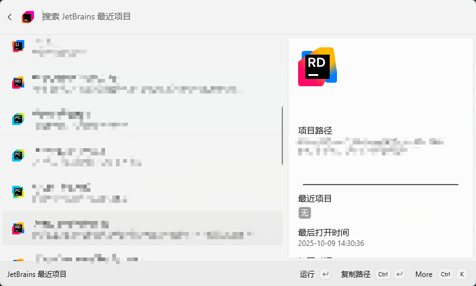

# Project QuickOpen for Command Palette

[English](README.md) | [中文](README_zh.md)
 
### Overview

Instantly search and open your recent JetBrains projects from CmdPal’s command palette.

### Features

- **🚀 Quick Project Access**: Instantly search and open recent projects from all JetBrains IDEs

### Installation

Choose one of the installation methods below:

Microsoft Store

  <a style="text-decoration:none" href="https://apps.microsoft.com/detail/9P7QFVGV9XZB">
    <picture>
      <source media="(prefers-color-scheme: light)" srcset="https://github.com/microsoft/PowerToys/blob/main/doc/images/readme/StoreBadge-dark.png?raw=true" width="148" />
      
  </picture></a>

### Custom Configuration

See docs: [Custom Path Configuration](doc/CustomConfiguration.md)

### License

This project is licensed under the MIT License - see the [LICENSE](LICENSE) file for details.
