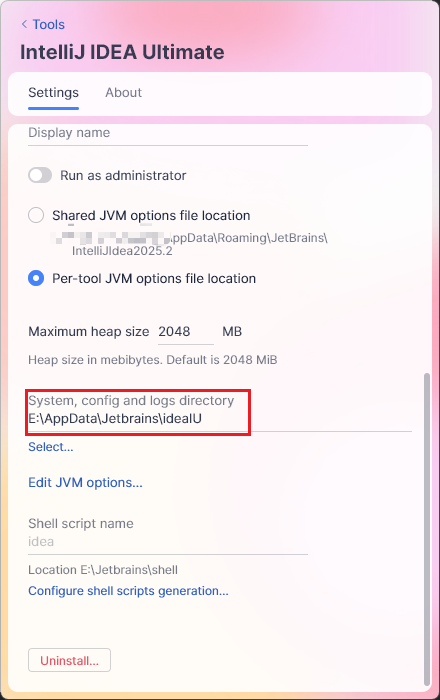
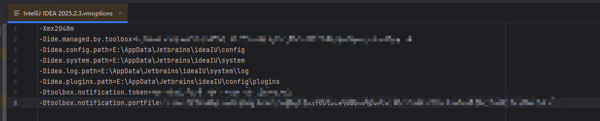

# Custom Path Configuration

## JetBrains Tools Installation Location
(omitted)

## System Configuration and Log Directory
- Using IntelliJ IDEA as an example, configure it in JetBrains Tools:
  
  

- Alternatively, set it in IntelliJ IDEA's VM Options:
  
  

- Final configuration result:
  
  